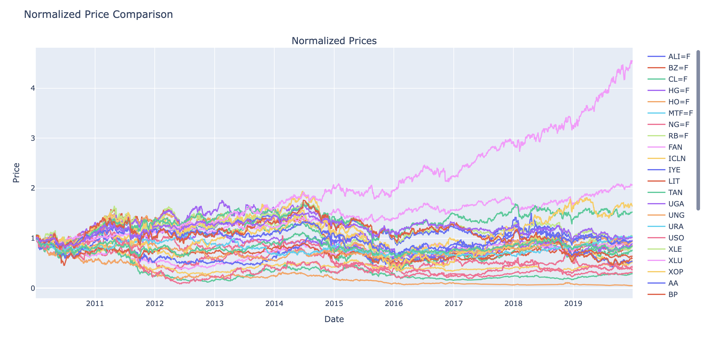
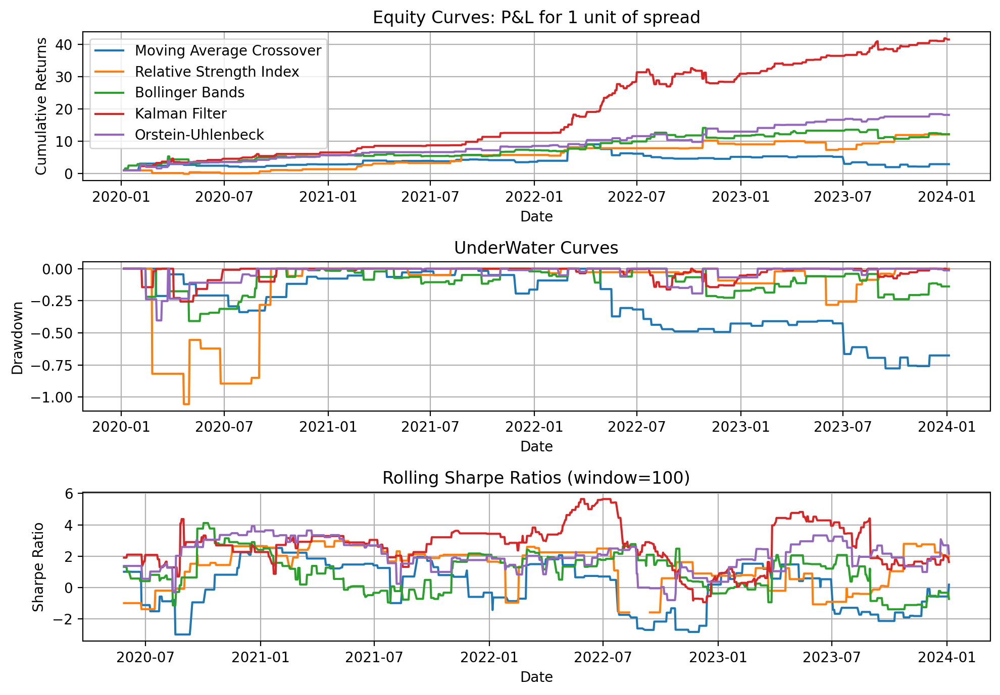

# Pairs & Basket Trading in Energy markets

[](LICENSE)

## Project Overview
This project focuses on implementing a **Pairs/Basket trading strategy** in the **Energy Markets**. The strategy is developed using **daily closing prices** from **2010 to 2024** across multiple asset classes, including:
- **Futures**  
- **Exchange-Traded Funds (ETFs)**  
- **Stocks**



---

## Project Objectives:  

The project aims to achieve four key objectives:  
1. **Compare Economic vs. Statistical Pair Selection**  
   - Evaluate the performance of pairs selected through **economic relationships** versus **statistical methods**.  

2. **Assess Hedge Ratio Models**  
   - Compare **backward-looking hedge ratio models** (e.g., **Rolling OLS**) with **forward-looking models** (e.g., **Double Exponential Smoother**, **Kalman Filter**) and evaluate their impact on backtest results.

3. **Evaluate Trading Strategies**  
   - Compare **technical indicators** (e.g., **Bollinger Bands**, **RSI**) with **statistical approaches** (e.g., **Kalman Filter**, **Ornstein-Uhlenbeck Process**) and evaluate their impact on backtest results.   

4. **Establish a Realistic Backtesting Framework**  
   - Develop a backtesting framework that incorporates **real-world trading constraints** such as **maximum drawdown** and **trade duration** constraints.

---

## **Instructions**  
Clone the repository:  
```bash
git clone https://github.com/anthonymakarewicz/energy-pairs-basket-trading pairs_trading
cd pairs_trading
```


## Usage
Below is an example that demonstrates the backtest of an **Orstein-Uhlenbeck** strategy using a **Double Exponential Smoother** hedge ratio.

### 1. Import data
```python
from utility.data_processor_helpers import fetch_data
from config import crack_tickers

start = "2014-01"
end = "2024-12"

crack_pairs = fetch_data(tickers=crack_tickers, start=start, end=end)
```

### 2. Create the the Hedge ratio and Strategy objects
```python
from pairs_trading.hedge_ratio import DoubleExponentialSmoothingHedgeRatio
from pairs_trading.strategy import OrnsteinUhlenbeckStrategy

hedge_ratio_des = DoubleExponentialSmoothingHedgeRatio()
strategy_ou = OrnsteinUhlenbeckStrategy()
```

### 3. Create the Backtester object and run the backtest
```python
from pairs_trading.backtest import Backtester

max_drawdown_limit = 0.10
max_trade_duration_multiplier = 2
transaction_cost_per_unit = 0.1

params_ou = {
    "strategy__window": [21, 30, 50, 65], 
    "strategy__exit_threshold": [0, 0.5, 1],
    "strategy__entry_threshold": [1.5, 2, 2.5],
}

backtester = Backtester(crack_pairs, strategy_ou, hedge_ratio_des, param_grid=params_ou)
backtester.run_backtest()
```

### 4. Evaluate the performance
```python
from pairs_trading.backtest import PerformanceAnalyzer

backtest = {"OU Strategy + DESP Hedge ratio": backtester_ma}
perf = PerformanceAnalyzer(backtest)
perf.plot_results()
perf.getMetrics()
```

## Notebooks / Analysis
The following Jupyter notebooks provide in-depth exploratory data analysis (EDA) and model evaluation:

- **`time_series_analysis.ipynb`** –  Demonstrates key concepts like **random walk** and **white noise** to introduce **cointegration**.  
- **`pairs_selection.ipynb`** –  Outlines the assets used and details the **pair selection** process. 
- **`pairs_trading.ipynb`** –  Explains the **pair trading strategy** and presents **backtest results**. 

For more detailed insights and plots, please refer to the notebooks directly.

## Results
Here is an example of the backtesting results between all trading strategies for the crack spread




